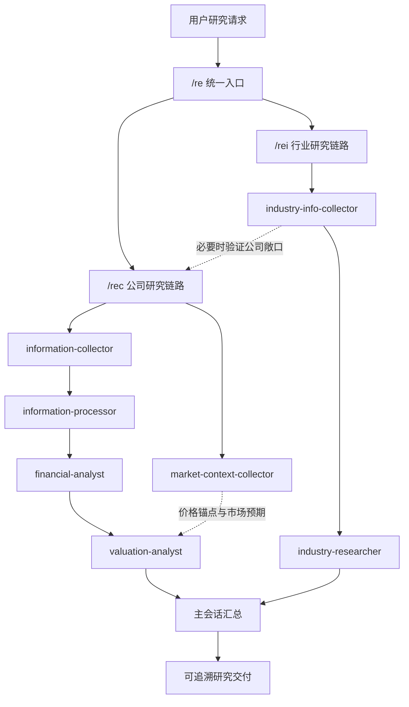

# multiagents：A 股多 Agent 投研编排系统

面向 A 股公司研究与行业研究的多 Agent 投研工作流。把资料采集、证据处理、财务分析、估值分析和行业研究拆成职责边界明确的角色，由主会话统一编排调度，强调证据可追溯、结论可降级、研究链路可复核。

> 本项目仅用于投研辅助、工作流编排和多 Agent 协作实验，不构成任何证券投资建议。所有研究结论都需要人类复核、合规判断和风险控制。

---

## 核心能力

- **公司研究链路**：A 股财报采集 → PDF 解析 → digest / RAG 证据处理 → 财务分析 → 估值分析，输出目标价区间与隐含回报。
- **行业研究链路**：行业层证据优先（政策、价格、供需、库存、事件），再按需引入锚点公司验证行业判断，支持战争 / 政策 / 供应冲击等事件驱动研究。
- **统一编排入口**：`/re`、`/rec`、`/rei` 三个 skill 负责识别意图并路由到对应链路，主会话只做调度、回流和汇总。
- **证据可溯源**：分析报告中的每个数字 claim 由校验脚本对照 digest 与 RAG 索引做双源引用核验，覆盖率不足会显式标注为输入限制。
- **结论可降级**：证据不足时研究状态必须降级为部分研究 / 框架草稿 / 证据不足，不允许把半成品包装成高置信结论。

---

## 总体架构



---

## 关键角色

| 角色 | 职责 | 典型产物 |
|---|---|---|
| `information-collector` | 检查/下载 A 股财报，维护披露清单和本地 PDF 路径 | manifest、PDF、采集状态 |
| `information-processor` | 解析 PDF，生成正文、digest、RAG 和摘要比对 | `content.json`、`llm_digest.json`、`rag_chunks.jsonl` |
| `financial-analyst` | 基于证据包形成经营、盈利质量、现金流和资产质量判断，输出预期差与估值输入 | `analyst_report.json/md` |
| `valuation-analyst` | 形成估值区间、目标价、隐含回报、边际安全和估值风险 | `valuation_report.json/md` |
| `market-context-collector` | 通过公开网页检索采集价格锚点、一致预期与市场事件，来源分级并强制置信度上限 | `market_context_package.json/md` |
| `industry-info-collector` | 组装行业层证据、政策/价格/供需/事件变量和锚点公司验证材料 | `industry_input_package.json/md` |
| `industry-researcher` | 输出行业归属、供需、景气、竞争格局和公司位置判断 | `industry_research_report.json/md` |

角色边界是硬约束：信息收集员不做投资判断，财务分析员不直接给目标价，估值分析员不替代财务质量判断，市场上下文只提供公开网页代理证据且置信度上限受限，行业研究不得只用单一公司表现替代行业结论。

---

## 设计要点

### 长文档的上下文隔离

处理对象是数百页的年报 PDF。主会话在角色之间只传递目标、文件路径、当前状态、缺口和下一步动作，禁止搬运 `content.md`、`llm_digest.md` 等长文档全文；需要核验时由对应角色回传精确证据定位。

### 文件契约数据总线

角色间通过 workspace 产物契约衔接：披露清单 → `content.json` → `llm_digest.json` → `rag_chunks.jsonl` → `analyst_report.json` → `valuation_report.json`。每层产物落盘可复用，调度前先盘点已有产物，缺什么补什么，不整链重跑。

### 确定性工具与 LLM 判断分离

约 1.8 万行 Python 脚本负责可复现的部分：巨潮公告采集、PDF 解析、digest 分段流水线、RAG 索引构建、财务证据草稿生成。LLM agent 只负责判断（业绩驱动、利润质量、预期差、估值），且必须把规则脚本生成的证据草稿当作待复核输入而非结论。

### 研究质量协议

- **状态机**：每个角色返回 `completed` / `partial` / `blocked`，附证据路径与缺口。
- **置信度单向降级**：主会话只能维持或下调下游状态，不得把 `partial`、`needs_more_evidence` 改写成高置信结论。
- **补证回流**：证据不足时下游返回结构化补证请求（`what_needed` / `priority` / `suggested_owner` / `expected_output`），由主会话回流上游。
- **终止条件**：每个主要缺口最多补证 2 轮、行业收集最多 2 轮、公司验证最多 1 轮，防止无限循环；命中终止条件后仍必须交付结构完整、缺口披露完整的报告。
- **证伪条件强制输出**：每条核心判断必须对应至少一个可跟踪变量和一个证伪条件。

### 数字级证据核验

`evidence_check.json` 对报告中的每个数字 claim 记录 digest 引用与 RAG 引用双源核验状态；digest 数字覆盖率不足 80% 时显式标注为输入限制，要求回到原文复核。

---

## 快速开始

### 1. 准备环境

推荐 Python 3.11+。

```bash
python -m venv .venv
source .venv/Scripts/activate
pip install -r info_processor_scripts/requirements.txt
```

显式依赖主要服务于 PDF 解析链路：`PyMuPDF`、`pypdf`、`Pillow`。

### 2. Claude Code 编排入口

```text
/re mode=company target=贵州茅台 fiscal_year=2025 depth=standard
/rec target=中泰股份 fiscal_year=2025 depth=standard
/rei target=氦气 anchor_companies=中泰股份 deliverable_type=theme_event_study focus=geopolitics,price,supply
```

- `/re`：统一识别公司研究或行业研究，并路由到对应链路。
- `/rec`：单家公司研究，默认进入财务分析和估值分析。
- `/rei`：行业/板块研究，默认行业证据优先，锚点公司只作为验证样本。

### 2.5 图形化控制台（研究工坊）

```bash
python research_console/app.py
# 浏览器打开 http://127.0.0.1:8600/
```

`research_console/` 提供 Web 图形入口，与 skill 入口共享同一套脚本与工作区：

- 公司研究默认使用 `coordinator_cli`：每个 run 只启动一个完整 `/rec` Claude Code 主协调会话，继续复用项目 `CLAUDE.md`、skills、custom agents 与既有工作区；
- 过程可视化由两条通道共同驱动：Claude Code `stream-json` 映射主协调器/Agent 实时事件，周期性 `research_state` audit 映射层状态与新产物；Canvas 舞台、日志、状态卡和产物浏览器同步更新；
- 原静态 DAG 完整保留为 legacy/fallback：manual（分步手工执行）/ claude_cli（分步调用本机 `claude -p`）/ skip；demo 与 replay 行为不变；
- `meta.json` 保存 `claude_session_id` 与执行模式，原始流另存 `claude_events.jsonl`；权威事件/meta/research_state 采用单调序号与原子落盘，同公司同财年由工作区租约防止并发覆盖，取消时先收拢并行任务和子进程再发布唯一终态；当前阶段尚不实现服务重启自动 resume 或独立动态研究请求协议。
- company run 在终态前冻结不可覆盖的 `decision_snapshot.json`，历史运行可在结论区并排查看“当时结论 / 现在回看”；回看记录追加到 `reviews.jsonl`，使用本地腾讯/东方财富日线及缺失时的可审计手工价格，生成描述性股价变化、四段估值区间与三档距离、可选基准超额，并保存证伪状态，固定标注非 TSR、非因果边界。

细节见 `research_console/README.md` 与 `research_console/CONTRACT.md`。

### 3. 直接运行脚本

```bash
# 采集 A 股财报
python "info_collector_scripts/run_cninfo_collection.py" \
  --start-date 2026-04-01 --end-date 2026-04-30 \
  --report-types annual --keyword 600519 --download

# 解析本地财报 PDF
python "info_processor_scripts/run_pdf_processing.py" \
  --stock-code 600519 --report-type annual --report-year 2025 --limit 1

# 准备 LLM digest 分段任务
python "info_processor_scripts/build_llm_digest.py" prepare \
  --content-json "info_processor_scripts/processor_workspace/parsed_reports/.../content.json" --overwrite

# 构建 RAG 索引
python "info_processor_scripts/build_report_rag_index.py" build \
  --content-json "info_processor_scripts/processor_workspace/parsed_reports/.../content.json" --overwrite

# 生成财务分析证据草稿（含 evidence_check 数字核验）
python "financial_analyst_scripts/run_financial_analysis.py" \
  --report-dir "info_processor_scripts/processor_workspace/parsed_reports/..."

# 组装行业输入包
python "industry_info_collector_scripts/run_industry_collection.py" \
  --target "氦气" --as-of-date 2026-06-03 --deliverable-type investment_research
```

海外公开源公司资料实验链路需要 SEC User-Agent：

```bash
SEC_USER_AGENT="your-name your-email@example.com" \
python "overseas_company_research_scripts/run_public_company_research.py" \
  --ticker MU --as-of-date 2026-06-03
```

---

## 目录结构

```text
multiagents/
├── .claude/
│   ├── agents/                         # 七个研究角色的 subagent 定义
│   ├── skills/                         # /re /rec /rei 编排路由入口
│   └── settings.json                   # 可共享的项目权限配置
├── info_collector_scripts/             # A 股财报采集脚本
├── info_processor_scripts/             # PDF 解析、digest、RAG 与摘要比对脚本
├── financial_analyst_scripts/          # 财务分析证据草稿与数字核验脚本
├── industry_info_collector_scripts/    # 行业输入包收集与组装脚本
├── industry_researcher_scripts/        # 行业研究产物工作区
├── valuation_analyst_scripts/          # 估值分析参考数据与运行产物目录
├── overseas_company_research_scripts/  # 海外公开源公司资料采集实验链路
├── CLAUDE.md                           # 项目级编排与调度规则
├── README.md                           # 项目说明
└── *.md                                # 各角色完整职责规程（SOP）
```

各角色运行产物默认写入自己的 `*_workspace/` 目录（财报 PDF、解析结果、RAG 索引、分析与估值报告），均不入库，可按上述脚本重新生成。

---

## 研究质量边界

- 行业研究不得只用单一公司表现替代行业结论。
- 弱代理变量不能支撑强结论，例如短期价格、单家公司合同负债或宏观大类数据。
- 估值输出应给出悲观、基准、乐观三档，而不是单点价格。
- 证据不足时应明确标记为低置信、部分研究或观察清单。
- 任何投资相关输出都必须保留核心假设、风险、缺口和证伪条件。
