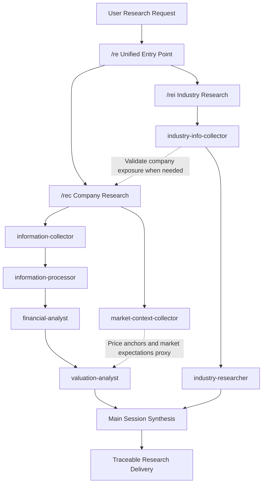

# multiagents: Multi-Agent A-Share Investment Research Orchestration

A multi-agent workflow for A-share company and industry research. Data collection, evidence processing, financial analysis, valuation, market context, and industry research are assigned to roles with explicit boundaries and coordinated by one persistent main session. The system emphasizes traceable evidence, honest confidence downgrades, reusable artifacts, and auditable research workflows.

> This project supports investment-research workflows and multi-agent collaboration experiments only. It does not constitute securities investment advice. Every conclusion requires human review, compliance assessment, and risk control.

---

## Core Capabilities

- **Company research workflow**: A-share filing collection → PDF parsing → digest and RAG evidence processing → financial analysis → valuation, including target-price ranges and implied returns.
- **Industry research workflow**: industry-level evidence first—policy, pricing, supply-demand, inventory, and events—followed by anchor-company validation when needed. Event-driven research supports wars, policy changes, sanctions, logistics disruption, and supply shocks.
- **Unified orchestration entry points**: `/re`, `/rec`, and `/rei` identify intent and route work to the matching workflow. The main session coordinates, handles backflow, and synthesizes results.
- **Traceable evidence**: numeric claims are checked against both digest and RAG evidence. Insufficient coverage is explicitly recorded as an input limitation.
- **Honest degradation**: insufficient evidence must produce a partial study, framework draft, low-confidence conclusion, or evidence-insufficient status rather than a falsely confident report.
- **English edition**: UI text, API errors, coordinator messages, newly generated reports, and human-readable JSON values are in English. Chinese proper nouns, filing titles, quotations, and search queries may remain Chinese only as source data.

---

## Architecture



---

## Research Roles

| Role | Responsibility | Typical artifacts |
|---|---|---|
| `information-collector` | Checks and downloads A-share filings and maintains disclosure manifests and local PDF paths | manifest, PDF, collection status |
| `information-processor` | Parses PDFs and generates document text, digest, RAG, and summary comparison | `content.json`, `llm_digest.json`, `rag_chunks.jsonl` |
| `financial-analyst` | Assesses operations, earnings quality, cash flow, and asset quality; produces expectation gaps and valuation inputs | `analyst_report.json/md`, formal financial analysis |
| `valuation-analyst` | Produces valuation ranges, target prices, implied returns, margin of safety, and valuation risks | `valuation_report.json/md` |
| `market-context-collector` | Uses public-web search to collect market narratives, price anchors, peer signals, themes, and contrary evidence under explicit confidence limits | `market_context_package.json/md` |
| `industry-info-collector` | Assembles industry evidence, policy/pricing/supply-demand/event variables, and anchor-company validation materials | `industry_input_package.json/md` |
| `industry-researcher` | Assesses industry classification, cycle conditions, supply-demand, competition, and company positioning | `industry_research_view.json` or industry report |

Role boundaries are hard constraints. Collectors do not make investment conclusions. The financial analyst does not issue target prices. The valuation analyst does not replace financial-quality analysis. Market context remains a public-web proxy with capped confidence. Industry conclusions cannot be inferred from one company alone.

---

## Design Principles

### Context isolation for long documents

Annual reports can run for hundreds of pages. The main session passes objectives, file paths, current state, gaps, and next actions—not full copies of `content.md`, `llm_digest.md`, or other long documents. Specialist roles return precise evidence locations when verification is needed.

### File-contract data bus

Roles communicate through reusable workspace artifacts:

`disclosure manifest → content.json → llm_digest.json → rag_chunks.jsonl → analyst_report.json → valuation_report.json`

Each layer is persisted and reusable. The orchestrator audits existing artifacts before dispatching work and reruns only missing, partial, stale, or incompatible layers.

### Deterministic tools separated from LLM judgment

Python scripts handle reproducible work: CNINFO collection, PDF parsing, digest pipelines, RAG indexing, evidence drafts, market-context packaging, and industry input packaging. LLM agents handle judgment: earnings drivers, financial quality, expectation gaps, industry interpretation, and valuation. Rule-generated drafts are evidence inputs, not final conclusions.

### Research quality protocol

- **State machine**: each role returns `completed`, `partial`, or `blocked`, with evidence paths and gaps.
- **One-way confidence degradation**: the main session may preserve or lower downstream confidence, but cannot rewrite `partial` or `needs_more_evidence` as high confidence.
- **Evidence backflow**: downstream roles return structured requests describing what is needed, priority, suggested owner, and expected output.
- **Termination conditions**: each major gap receives at most two evidence rounds by default; industry collection receives at most two rounds and company validation one round. Even after termination, the final report must remain structurally complete and disclose unresolved gaps.
- **Mandatory falsification conditions**: every core conclusion must include at least one trackable variable and one condition that would invalidate it.

### Numeric evidence verification

`evidence_check.json` records digest and RAG references for numeric claims. Digest numeric coverage below 80% is explicitly marked as an input limitation and requires verification against the original filing.

---

## Quick Start

### 1. Prepare the environment

Python 3.11 or later is recommended.

```bash
python -m venv .venv
source .venv/Scripts/activate
pip install -r info_processor_scripts/requirements.txt
```

The explicit dependency file currently focuses on the PDF-processing workflow: `PyMuPDF`, `pypdf`, and `Pillow`.

### 2. Use the Claude Code orchestration entry points

```text
/re mode=company target=600519 fiscal_year=2025 depth=standard
/rec target=600519 fiscal_year=2025 depth=standard
/rei target=helium anchor_companies=300435 deliverable_type=theme_event_study focus=geopolitics,price,supply
```

- `/re`: identifies company or industry intent and routes to the appropriate workflow.
- `/rec`: runs single-company research, including financial analysis, market context, and valuation by default. Unless a filing is explicitly pinned, it uses `recent_history`: the latest two eligible annual reports, all prior-year interim filings, and current-year interim filings that are published or have reached their normal filing deadline as of the cutoff.
- `/rei`: runs industry or sector research with industry evidence first and anchor companies used only for validation.

### 3. Launch the graphical research console

```bash
python research_console/app.py
# Open http://127.0.0.1:8600/
```

`research_console/` provides a browser interface backed by the same scripts and workspaces as the skill entry points:

- Company research uses `python_agent_coordinator` by default. Python owns the plan and dispatches registered agents with explicit I/O contracts; Claude Code runs only as a bounded worker per step.
- Two channels drive visualization: Claude Code `stream-json` events for coordinator/agent activity and periodic `research_state` audits for layer state and newly created artifacts.
- The legacy deterministic DAG remains available as a fallback through manual, stepwise Claude CLI, and skip modes. Demo and replay modes are also available.
- `meta.json` stores the Claude session ID and execution mode. Raw Claude events are saved to `claude_events.jsonl`. Authoritative events and metadata use monotonic sequence numbers and atomic persistence.
- Company runs freeze an immutable `decision_snapshot.json` before terminal delivery. Historical runs support side-by-side Original View / Current Review comparisons, with reviews appended to `reviews.jsonl`.

See [research_console/README.md](research_console/README.md) and [research_console/CONTRACT.md](research_console/CONTRACT.md) for implementation details.

### 4. Run scripts directly

```bash
# Collect A-share filings
python "info_collector_scripts/run_cninfo_collection.py" \
  --start-date 2026-04-01 --end-date 2026-04-30 \
  --report-types annual --keyword 600519 --download

# Parse a local financial-report PDF
python "info_processor_scripts/run_pdf_processing.py" \
  --stock-code 600519 --report-type annual --report-year 2025 --limit 1

# Prepare LLM digest chunks
python "info_processor_scripts/build_llm_digest.py" prepare \
  --content-json "info_processor_scripts/processor_workspace/parsed_reports/.../content.json" --overwrite

# Build the RAG index
python "info_processor_scripts/build_report_rag_index.py" build \
  --content-json "info_processor_scripts/processor_workspace/parsed_reports/.../content.json" --overwrite

# Build the default multi-period filing-set handoff
python "financial_analyst_scripts/run_financial_analysis.py" \
  --research-state "research_orchestrator_scripts/orchestrator_workspace/company_state/600519/2026-06-15/research_state.json"

# Generate a legacy single-filing evidence draft
python "financial_analyst_scripts/run_financial_analysis.py" \
  --report-dir "info_processor_scripts/processor_workspace/parsed_reports/..."

# Assemble an industry input package
python "industry_info_collector_scripts/run_industry_collection.py" \
  --target "helium" --as-of-date 2026-06-03 --deliverable-type investment_research
```

The experimental overseas public-source company workflow requires an SEC User-Agent:

```bash
SEC_USER_AGENT="your-name your-email@example.com" \
python "overseas_company_research_scripts/run_public_company_research.py" \
  --ticker MU --as-of-date 2026-06-03
```

---

## Repository Structure

```text
multiagents/
├── .claude/
│   ├── agents/                         # Research-role subagent definitions
│   ├── skills/                         # /re, /rec, and /rei orchestration entry points
│   └── settings.json                   # Shared project permission configuration
├── .codex/agents/                      # Codex-compatible role definitions
├── info_collector_scripts/             # A-share filing collection
├── info_processor_scripts/             # PDF parsing, digest, RAG, and summary comparison
├── financial_analyst_scripts/          # Financial evidence drafts and numeric verification
├── market_context_collector_scripts/   # Public-web market-context collection
├── industry_info_collector_scripts/    # Industry input-package collection and assembly
├── industry_researcher_scripts/        # Industry research artifact workspace
├── valuation_analyst_scripts/          # Valuation references and runtime artifacts
├── research_orchestrator_scripts/      # Research-state auditing and orchestration support
├── research_console/                   # FastAPI web console
├── CLAUDE.md                           # Project orchestration rules
├── AGENTS.md                           # Codex-compatible project rules
└── README.md                           # Project documentation
```

Runtime artifacts are written to role-specific `*_workspace/` directories. PDFs, parsed reports, RAG indexes, analysis outputs, valuations, and console runs are intentionally excluded from version control and can be regenerated by the workflows above.

---

## Research Boundaries

- Industry conclusions cannot be derived from one company alone.
- Weak proxies—short-term pricing, one company's contract liabilities, or broad macro categories—cannot support strong conclusions by themselves.
- Valuation must include bear, base, and bull cases rather than a single point estimate.
- Insufficient evidence must be labeled low confidence, partial research, or watch-only.
- Every investment-related output must preserve its core assumptions, risks, gaps, and falsification conditions.
